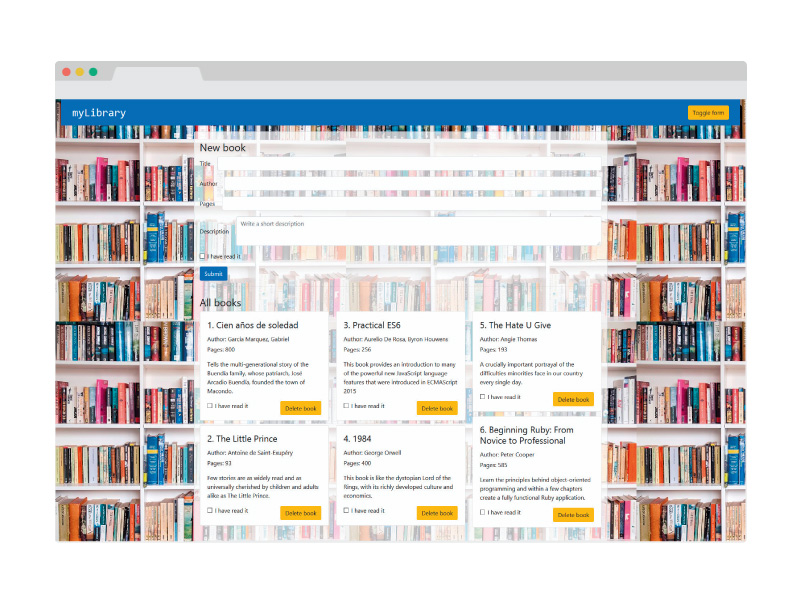

# My Library

> A library of books made with Javascript. Includes a form where users can add books with basic info about 
it. This is the first app I make with Javascript, so any comments/improvements are totally welcomed.



I made use of Object Oriented capabilities of Javascript, like prototyping and the 'this' keyword.

## Built With

- HTML5
- Bootstrap 4
- JS ES6

## Live Demo

[Live Demo Link](http://mauriciosantos.paternit.com/io/library/)

## Getting Started

```
- Go to live demo url

- Hit toggle form button to show create book form

- Fill fields with book data

- Hit submit button

- After created the book, you can go to library bellow and update books by deleting them or changing read status.


```

👤 **Author**

- Github: [@githubhandle](https://github.com/maosan132)
- Twitter: [@twitterhandle](https://twitter.com/maosan132)
- Linkedin: [linkedin](https://www.linkedin.com/in/mauricsantos/)
## 🤝 Contributing

Contributions, issues, and feature requests are welcome!

Feel free to check the [issues page](issues/).

## Show your support

Give a ⭐️ if you like this project!

## Acknowledgments

- Hat tip to anyone whose code was used
- Inspiration
- etc

## 📝 License

This project is [MIT](lic.url) licensed.
